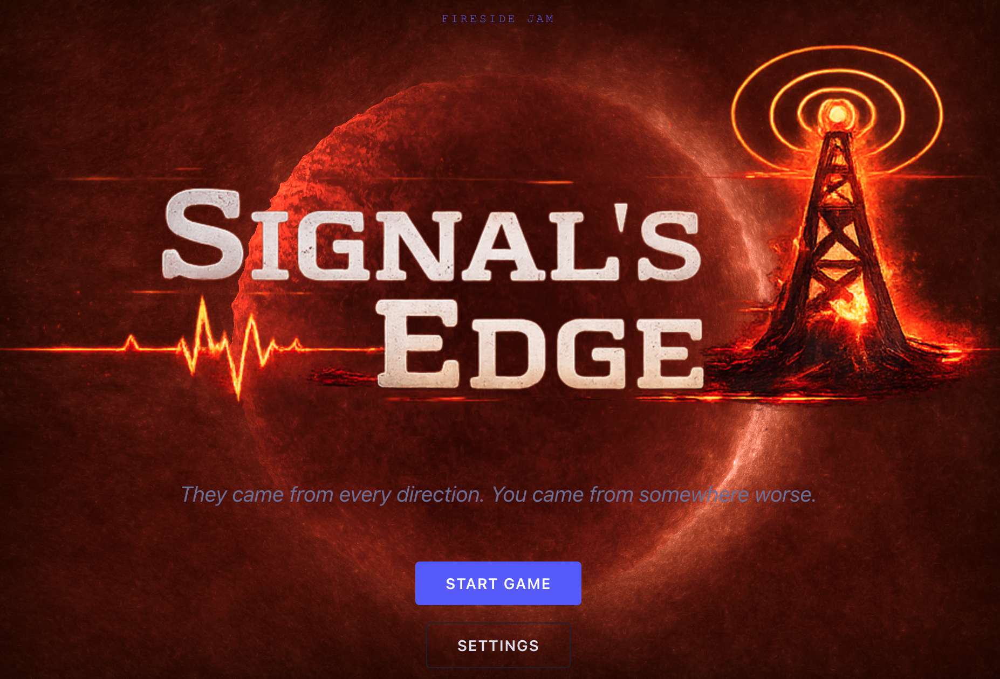
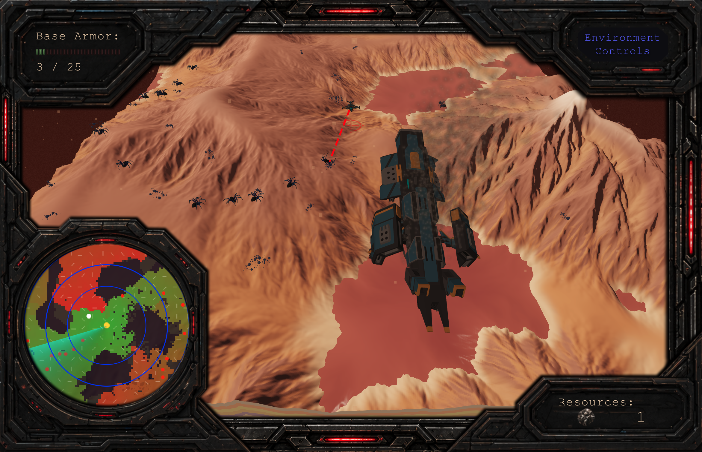

# LD59 — Signal's Edge
### *They came from every direction. You came from somewhere worse.*

A top-down survival defense game where you balance base protection, resource gathering, and signal integrity on a hostile alien world. After crash landing, you must expand outward under constant pressure, harvesting materials to construct and stabilize a transmission array while escalating alien waves force you to choose between defense, exploration, and getting a distress signal out before everything collapses.

**Engine:** Three.js (HTML5), ES modules  
**Jam track:** Ludum Dare 59 · **Fireside Jam** · GDFG · 100 Day Jam  

**Ludum Dare 59 (Apr 17–19, 2026):** **complete** — first milestone shipped (LD / embed / local package).

**Fireside Jam (Apr 17–26, 2026, theme: Manage):** **complete** — credits compliance, dock/store retune, opening pressure pass, enemy creature swap.

**GDFG (Apr 9–May 3, 2026, theme: Double Crisis):** **complete** — second resource (Helion), early-game tension, double-crisis economics, enemy size tiers, larger flow field.

**100 Day Jam (Jan 31–May 12, 2026, theme: Horror — Lost Signal):** **shipped as final jam build**; ongoing post-jam polish in this branch.

---

## The Strategy

Rather than burning out on a single 72-hour jam, this project runs across four overlapping game jams with staggered deadlines. The same game is submitted to each — every weekend is another jam deadline, another forced polish pass, another revision. The game compounds instead of getting abandoned.

| Jam | Dates | Theme | Goal |
|-----|-------|-------|------|
| Ludum Dare 59 | Apr 17–19 | Signal | Playable core loop |
| Fireside Jam | Apr 17–26 | Manage | Feels like a real game |
| GDFG | Apr 9–May 3 | Double Crisis | Depth and drama |
| 100 Day Jam | Jan 31–May 12 | Horror – Lost Signal | Polished final release |



---

## Post-jam polish backlog

All four jam deadlines are past. Live backlog (carry items not closed during the jams):

- [ ] Spawn presentation: surface portals / emerge animation instead of perimeter-line spawns
- [ ] Tower tier behavior split (mini / medium / mega currently share `_purchaseTower()` flow with different costs)
- [ ] Additional enemy archetypes + death VFX
- [ ] Map events, environmental hazard layer, exploration caches
- [ ] Ship upgrade meta between sorties
- [ ] Screen shake; fog-of-war treatment; wave callouts
- [ ] Improved game-over screen
- [ ] Wave-start sting and tower-impact SFX
- [ ] Restore localization UI (`TranslationManager` is loaded again, but the language selector and per-screen string sync are partial)

---

## Week 1 — Ludum Dare 59 (Apr 17–19, 2026) — COMPLETE

*Goal: does it feel like a game? Ship something playable.*

### Core loop (all in the LD59 build)

- [x] Three.js scene with procedural terrain (shader heightmap + CPU mirror in `terrain.js`)
- [x] Ship, hangar, **cruiser wreck** (`SM_Ship_Cruiser_02.fbx` parented under hangar with baked pose), transmission mast, defense tower pieces, resource pickups — FBX (`FBXLoader`, local `js/jsm` + `js/three.module.js`). Mast fitted height **`TRANSMISSION_VISUAL_HEIGHT`** (~**0.775** world units full build); hidden when base scrolls off the terrain tile (same **`TERRAIN_HALF`** rule as hangar). Cruiser **damage smoke** (`THREE.Points`, intensity vs missing armor).
- [x] Delta-time game loop; screen flow Loading → Menu → Game; settings modal
- [x] WASD / arrow flight; ship banking and pitch; autopilot takeoff / landing; snap-to-pad when near base
- [x] Geological cross-section; sky shader; **main menu** — dual WebGL layers (`#menu-bg-canvas` planet shader + `#menu-intro-canvas` cruiser and warp exit VFX); staggered ship path and hull fade-in on Start; gameplay begins on landscape (captain’s-log modal removed); centered WASD hint fades on first movement key.
- [x] **Enemies** — `spider.glb` with mixer (walk/attack/death), flow-field movement; root yaw tracks motion direction in world space; **one** base HP damage per enemy on contact then death clip / removal (no drain-while-standing bug).
- [x] **Waves** — ~**60 s** timer, count doubles each wave to cap (1 → 2 → 4 → … → 256) — *schedule itself is a tuning target for Fireside (see sprint goals)*
- [x] **Ship laser** — dashed `Line2` / `LineMaterial`; SFX
- [x] **Resources** — 100 pickups (FBX + fallback), tractor beam; HUD count (split label/value, see `#hud-resources-label` / `#hud-resources-value` in `index.html`). Helion variant added post-LD (see Week 3).
- [x] **Base HP HUD** — label + 25-bar graph + numeric readout (`GameScreen.js` syncs bar segments to `BASE_MAX_HP`)
- [x] **Dock store** — `store.json` drives catalog cards (repair, transmission, three tower SKUs → same `_purchaseTower()` until tiers split); ratio node is omitted when `max` is null/empty; `fetch('./store.json')` at runtime (**include in zip** for embeds). Base armor starts damaged (**5 / 25** max); repair spends resources toward **25**.
- [x] **Defense towers** — purchase at dock, **T** to place; FBX base + weapon; tower lasers + SFX
- [x] **Win / lose** — distress win + transmission win + base destroyed overlay
- [x] **Radar HUD** (position/size in `css/style.css` — `.flow-radar-hud` / `.flow-radar`); direction arrow; target reticle
- [x] **AudioManager** — channel gains; BGM; klaxon vs armor; VO + warp + first-resource sting; `fetch` + XHR fallback for buffers; `localStorage` when embed allows

### Known gaps (carry to Fireside / later)

- [ ] Broader difficulty / economy tuning
- [ ] Spawn presentation (perimeter portals instead of border spawn line)
- [ ] Language selector / `TranslationManager` pipeline is commented out for this build; restore when localizing

---

## Week 2 — Fireside Jam (due Sunday Apr 26, 2026) — COMPLETE

*Theme: **Manage** — credits, clarity, and “this is a finished slice,” not only new mechanics.*

Single concentrated work block (~12–14 h). Optimized for shippable deltas: credits compliance, clearer presentation, stronger early-game feel, and one solid enemy visual pass.

### Combat and building

- [x] Ship weapon; defense towers; resource economy in dock

### Feel

- [x] Baseline SFX + music channel
- [x] Main menu **Start** handoff — dual-canvas planet zoom plus 3D cruiser + warp exit (`MenuScreen.js`, `#menu-intro-canvas`)
- [x] Game over screen
- [x] Credits **content** in Settings system tab (shell + scrollable panel shipped — **required for jam rules**)

- [X] **Credits (Fireside requirement)** — full attribution for code, libraries, fonts, Synty (or other) asset packs, any CC models, sounds, and tools. **Settings UI:** fill **`#settings-info-text`** (system tab) with real credits copy; tab toggle is wired (header click, `system_modal.png` background). Judges still need the **content** completed and proofread.
- [x] **Enemy creature model pass** — replaced torus placeholder with `assets/obj/spider.glb`; enemy scale tuned down; attack/death playback works; walk clip selection now auto-falls back by name matching and clip exclusion.
- [x] **Wave pacing / opening pressure** — added a strong opening read by spawning **50 enemies at session start**, scattered over valid flow-field cells. Regular wave schedule remains the 60-second cadence.
- [ ] **Spawn presentation** — stop enemies **materializing in a long line on the UV border**; add **spawn holes / surface portals** (mesh + short emerge animation or staged visibility) so spawns read as “emerging from the ground” at a small set of perimeter points.
- [x] **UI pass (current sprint)** — dock store card layout retuned for manual positioning: card body de-flexed, ratio/cost decoupled via absolute positioning, ratio omitted when `store.json` `max` is null/empty, and dock footer actions removed from modal markup for a cleaner panel while polishing.
- [ ] **Audio “attention” pass** — klaxon loop while base armor &lt; max (`AudioManager` + `assets/audio/klaxon.mp3`); first-resource sting (`ironOre.mp3`); VO at game start (`hostilesInbound` → `takeTheFighter`). Still wanted: wave sting; attack/impact when enemies hit towers.

### Ship / ops (non-code or parallel)

- [x] **itch.io** — create/update the Fireside Jam game page, screenshots, short description, credits mirror, and upload the same zip build you use for the jam.
- [x] **Playtest pass** — 10–15 minutes after changes: embed rules (no external `fetch` to third parties), storage off in iframe, and **zip root `index.html`**.


### Already true in repo (do not duplicate work)

- [x] Dock **manage** loop — spend resources on repair, tower, transmission increments, weapon tier; distress win when funded.
- [x] **Local Three** — `index.html` import map → `./js/three.module.js` + explicit `./js/jsm/...` paths; `FBXLoader` patched for r169 `ColorManagement.toWorkingColorSpace` API.
- [x] **Core SFX pipeline** — `AudioManager`: BGM, VO chain, warp sting (`introCutScene.mp3`), klaxon (armor-scaled loop), `ironOre` first pickup, blasters, resource pickup; buffers decode after `init()` with pending-play flush for async loads.
- [x] **100 resource nodes**, expanded flow field (`FLOW_FIELD_AREA_MULT`), radar (**F**), transmission + towers + win overlay (from LD weekend).

---

## Week 3 — GDFG (due Sunday May 3, 2026) — COMPLETE

*Theme: Double Crisis. Increase early-game tension, enforce the double crisis, and improve clarity of combat + resource loops.*

### 1. Opening sequence

- [x] Ship crash → immediate player control (no delay)
- [x] Enemies already active when control begins
- [x] Delay AI messaging until after action starts
- [x] Trigger resource tutorial only after first pickup

Player is under pressure within the first 5–10 seconds.

### 2. Enforce double crisis

- [x] Base starts partially damaged — session begins at **5 / 25** armor (`BASE_START_HP` / `BASE_MAX_HP`); repair toward max via dock
- [x] Maintain low-level enemy trickle after initial clear (60 s wave cadence + 50-enemy opening salvo, `INITIAL_ENEMY_COUNT`)
- [x] Place resources slightly outside the safe zone — flow-field span doubled to **`FLOW_FIELD_AREA_MULT = 16`** (16× unit-tile area; 4× linear span); pickup distribution scales with it
- [x] Every dock SKU now demands **both** Iron and Helion (see resource adjustment below), so the player cannot park on one income stream

### 3. Resource system — Iron + Helion

- [x] **Second resource type shipped.** `ResourceManager.js` adds purple PBR Helion pickups with emissive pulse (`HELION_PULSE_DARK` → `HELION_PULSE_BRIGHT`); world spawn rate `HELION_WORLD_CHANCE = 0.2` (20% of pickups + 20% of enemy-kill drops are Helion).
- [x] HUD shows split readout — `#hud-resources-label`/`#hud-resources-value` for Iron and `#hud-helion-label`/`#hud-helion-value` for Helion.
- [x] `store.json` schema migrated from `cost` → `costIron` + `costHelion`. Current dock economics:

```json
{
  "repair":        { "costIron":  1, "costHelion":  1, "max":  25 },
  "transmission":  { "costIron":  1, "costHelion":  2, "max": 200 },
  "tower_mini":    { "costIron": 15, "costHelion":  5 },
  "tower_medium":  { "costIron": 30, "costHelion": 10 },
  "tower_mega":    { "costIron": 45, "costHelion": 15 }
}
```

- [x] Tractor beam tint follows pickup kind — purple (`0xcc77ff`) for Helion, blue (`0x4488ff`) for Iron.

### 4. Enemy size tiers

- [x] Per-enemy tier roll (`_rollEnemyTier`): **75% small / 20% medium / 5% large**
- [x] Tier scales mesh size (1× / 2× / 4× via `ENEMY_TIER_SCALE`) and inversely scales speed + animation rate (1× / 0.5× / 0.25× via `ENEMY_TIER_SPEED`)
- [x] Contact radius scales with `tierScale` so larger spiders register hits at a wider range, and radar dot size grows with tier (3 / 4 / 5 px)

### 5. Carryover / not closed in this sprint

- [ ] Spawn presentation (surface portals / emerge VFX)
- [ ] Tower tier gameplay split (currently same `_purchaseTower()` flow at three price tiers)
- [ ] Ship upgrade meta between sorties
- [ ] Map events, hazard layer, exploration caches

---

## Week 4 — 100 Day Jam (due May 12, 2026) — SHIPPED

*The game you always wished you had time for. Final jam build went out at the May 12 deadline; items below are status as of submission.*

### Polish that landed

- [x] Settings tab UI (`Environment controls` / `System info`) with credits panel content
- [x] Win/lose overlay copy + restart-to-menu flow
- [x] Iron + Helion economy across all SKUs
- [x] Enemy size tiers + larger flow field
- [x] `TranslationManager` re-wired in `main.js` and threaded into `SettingsModal` + `GameScreen`; settings-screen labels sync from the table when present (HTML keeps English defaults)

### Did not make the cut

- [ ] Roguelite meta / upgrade tree
- [ ] Full audio mix pass; wave-start sting; tower impact SFX
- [ ] Particles + spawn-portal VFX
- [ ] Leaderboard
- [ ] Restored localization UI (selector still commented out — only the manager + string sync hooks are wired)

---

## Architecture

### Menu title sequence (`MenuScreen.js`, `index.html`, `css/style.css`)

The main menu uses **two stacked canvases** on `#screen-menu`: the **raw GLSL planet** on `#menu-bg-canvas`, and a **transparent WebGL overlay** on `#menu-intro-canvas` (higher `z-index`, `pointer-events: none`) for the cinematic beat when the player hits **Start**.

- **Cruiser** — `assets/obj/SM_Ship_Cruiser_02.fbx` via `FBXLoader`, `OBJ_SCALE`, and the same Polygon atlas Phong pattern as in `GameScreen.js` (textures under `assets/textures/`).
- **Motion** — `_shipIntroPathT`: first **2 s** covers **half** the hand-tuned arc (ease-out); the rest of the **8 s** zoom uses the same **ease-in-out cubic** as planet `uZoomT`. Pose numbers (`x0`, `scale0`, etc.) are edited in `_updateCruiserPose`.
- **Hull fade-in** — **500 ms** opacity ramp using `THREE.MathUtils.smoothstep(elapsed, 0, SHIP_FADEIN_MS)` (first argument is clock time). Intro hull material uses `depthWrite: false` so warp layers stay readable.
- **Warp exit** — Fresnel bubble `ShaderMaterial`, bow torus, flash disc, `THREE.Points` stream, two point lights (tunnel ring stack removed for clarity); strength follows **planet** `zoomT`, not hull opacity, so VFX can precede the ship.
- **Renderer** — Intro `WebGLRenderer` uses **`NoToneMapping`** so additive passes stay bright.

```
index.html                — import map: `three` → ./js/three.module.js; explicit ./js/jsm/... addon paths; optional ./js/browser.js (fflate) if needed; menu stack: `#menu-bg-canvas` + `#menu-intro-canvas`
store.json                — Dock store catalog (items: id, action, name, description, costIron, costHelion, image; optional tower max); loaded by GameScreen
js/
  three.module.js         — Three r169 bundle (keep in sync with js/jsm addon versions)
  jsm/                    — examples modules (FBXLoader, lines, curves, libs/fflate.module.js, …)
  shaders/                — terrain + shared noise
  AudioManager.js
  EnemyManager.js         — Flow field (16× unit-tile area); spawn/update/kill; GLTF spider + mixer; per-enemy size tier (small/medium/large) scales mesh, speed, contact radius, and radar dot; face velocity; one-shot base contact damage
  GameScreen.js           — Scene, loop, ship, weapons, dock store UI (Iron+Helion costs), transmission (mast scale + tile visibility), cruiser wreck + smoke, win/lose HUD, base backdrop, opening 50-enemy salvo (`INITIAL_ENEMY_COUNT`)
  LoadingScreen.js
  MenuScreen.js           — Planet fullscreen shader (`#menu-bg-canvas`); intro 3D pass (`#menu-intro-canvas`): `SM_Ship_Cruiser_02.fbx`, layered warp VFX, start-transition handoff to game
  ResourceManager.js      — Iron + Helion pickups (purple PBR + emissive pulse for Helion, `HELION_WORLD_CHANCE = 0.2`); tractor beam tint per kind; enemy-kill drops mirror world spawn ratio
  ScreenManager.js
  SettingsModal.js        — Audio volumes; tabs in header (`environment` / `system` credits); strings sync from `TranslationManager` when present (HTML keeps English defaults); persist on dismiss; language selector still commented out pending UI restore
  TranslationManager.js   — Loads `translations.csv` and exposes `getText(stringId)`; wired through `main.js` into `SettingsModal` and `GameScreen`
  terrain.js
  main.js

assets/
  obj/                    — FBX models
  textures/               — HUD frames, radar, **store** / **modal** / **buy** PNGs, `base_bkgd.png`, logos
  audio/                  — BGM, WAV / MP3 SFX (`warp`/`introCutScene`, VO, `klaxon`, `ironOre`, blasters, pickup, …)
```

### Coordinate system

The ship stays at world `(0, y, 0)`. Terrain, hangar, and transmission mast move opposite the scroll offset (mast uses **`TRANSMISSION_PAD_OFFSET_X`** beside the pad). Enemies and resources use heightmap UV coordinates; each frame:

```
worldX = (uvx - 0.5) * uScale - offset.x
worldZ = -(uvy - 0.5) * uScale + offset.y
```

### Flow field

`EnemyManager` builds **Dijkstra** on a UV grid whose span follows `FLOW_FIELD_AREA_MULT` (currently **16×** unit-tile area; ~4× linear span vs LD weekend). Resolution scales with span (`GRID = max(96, round(96 * sqrt(MULT)))`). Blocked cells: water, steep slope, thin-air height (`HIGH_ALT = 0.525`). Enemies sample the field each frame; per-enemy `speedMul` (1 / 0.5 / 0.25 for small / medium / large tiers) modulates `ENEMY_SPEED` and the animation mixer `timeScale`.

### Enemy tiers

`_rollEnemyTier` in `EnemyManager.js` picks per spawn:

```json
{
  "small":  { "weight": 0.75, "scale": 1, "speedMul": 1.0,  "radarRadiusPx": 3 },
  "medium": { "weight": 0.20, "scale": 2, "speedMul": 0.5,  "radarRadiusPx": 4 },
  "large":  { "weight": 0.05, "scale": 4, "speedMul": 0.25, "radarRadiusPx": 5 }
}
```

`CONTACT_DIST` is multiplied by `tierScale`, so larger tiers register base hits at a proportionally wider radius and broadcast a louder attack-clip transition window (`d2 < contactR² * 2.2`).

---

## Notes

- **Flow:** Loading → Menu → Game. `TranslationManager` is loaded again in `main.js` and passed to `SettingsModal` + `GameScreen`; the in-game language selector UI in `index.html` is still commented out, so visible strings fall back to the HTML defaults until the selector is restored.
- **`store.json`** must ship beside **`index.html`** (same folder in the zip) so `fetch('./store.json')` works on itch and other static hosts.
- Hand-tweaked **game HUD** layout lives in `index.html` (`#game-hud`) and `css/style.css`. See `.cursor/rules/ld59-hud-layout.mdc` for agent guidance when editing those files.
- Movement uses delta time; drag uses `Math.pow(0.35, delta)`; lerps clamp with `Math.min(1, delta * rate)`.
- Menu and game each use their own `THREE.Clock`.
- Keep **`js/three.module.js`** and **`js/jsm/**`** on the **same Three.js revision** (or patch `ColorManagement` API mismatches).
- FBX textures: `setResourcePath('assets/textures/')`; paths inside FBX must exist in the zip for embed hosts.
